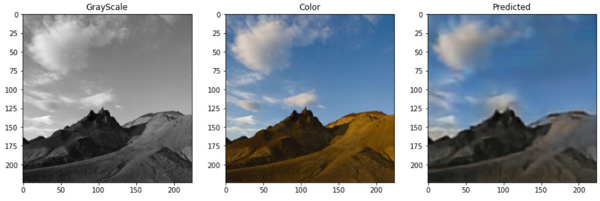
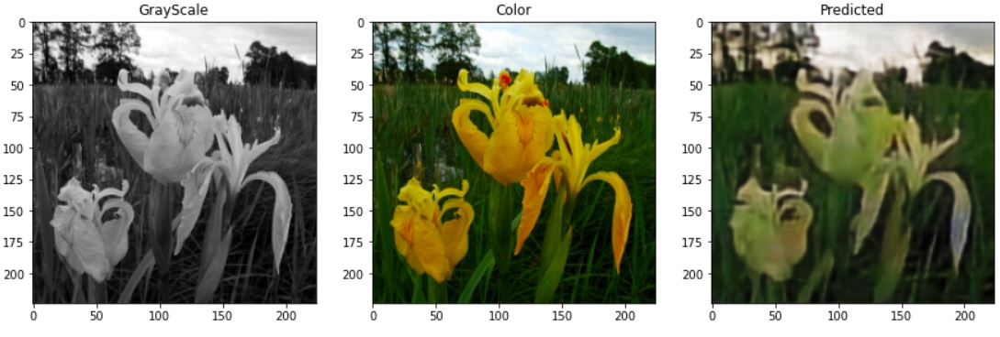
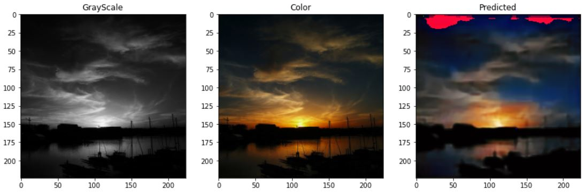
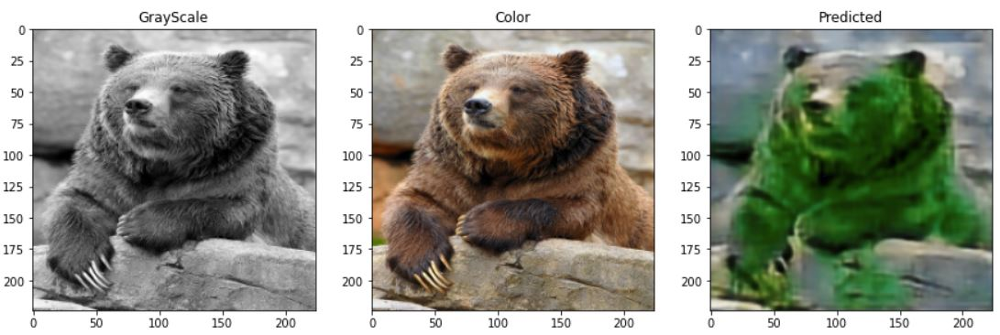
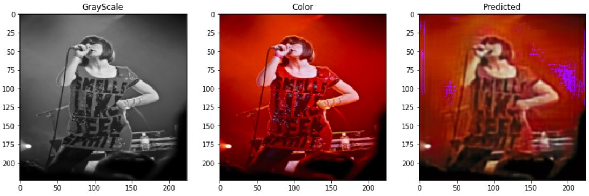

# Image-Colorizer
Deep Learning project for colorizing images with convolutional neural networks using different network architecture.

Examples of the Autoencoder with classifier arqutecture:

Referencies: 

* IIzuka, Satoshi, and Edgar Simo-Serra. “Let there be Color!: Joint End-to-end Learning of Global and
Local Image Priors for Automatic Image Colorization with Simultaneous Classification.” ACM
Transactions on Graphics, vol. 35, no. 4, 2016, pp. 1-11,
http://iizuka.cs.tsukuba.ac.jp/projects/colorization/data/colorization_sig2016.pdf. Accessed 9
Abril 2022.

* Wallner, Emil. “How to colorize black & white photos with just 100 lines of neural network code.”
medium.com, 2017,
https://emilwallner.medium.com/colorize-b-w-photos-with-a-100-line-neural-network-53d9b44
49f8d. Accessed 11 April 2022.
